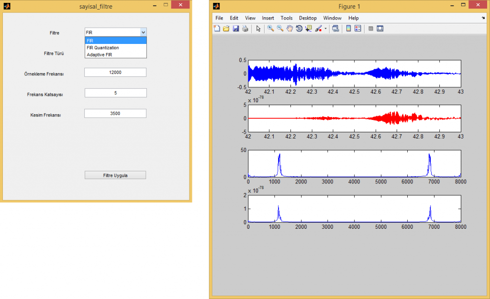

**FIR GERÇEK ZAMANLI SES GÖSTERİMİ** 

----------

Promizde mikrofon üzerinden gerçek zamanlı olarak alınan ses sinyalini kullandık. Bu sinyal üzerine farklı FIR filtrelerini uygulayarak gösterimini gerçekleştirdik. Öncelikli olarak gerçek zamanlı ses sinyalimiz mikrofon üzerinden alınarak ses üzerinde FIR, Adaptive FIR, FIR Quantitization uygulanarak farklı FIR filtrelerinin gösterimi amaçlanmıştır. 

----------
